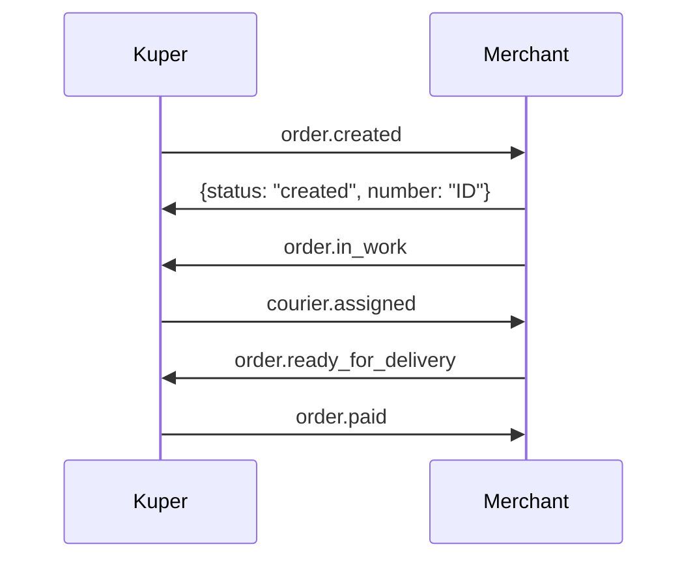

# Блок-схемы для Push-модели интеграции с Купер API

Комплект документации и диаграмм для интеграции мерчанта с [Купер API](https://docs.kuper.ru/api-products/merchant-service/orders/description) по Push-модели.

## 📋 Содержание проекта

### 📊 Основные файлы

1. **[Главная блок-схема Push-модели](./assets/kuper-push-model-flowchart.md)**
   - Общий алгоритм работы с заказами
   - Детальные схемы обмена сообщениями для всех типов интеграции
   - Правильная последовательность вебхуков и уведомлений
   - Ключевые моменты реализации

2. **[Диаграммы состояний заказа](./assets/kuper-order-states.md)**
   - Состояния заказа в системе Купера для разных типов интеграции
   - Состояния оплаты
   - Детальный жизненный цикл событий по типам
   - Обработка ошибок и отмен

3. **[Справочник API](./assets/kuper-api-reference.md)**
   - Таблицы всех endpoint'ов с правильным порядком событий
   - Примеры HTTP запросов для всех уведомлений
   - Коды ошибок и сценарии тестирования
   - Чек-лист для интеграции по типам

### 🎯 Детальные схемы по типам интеграции

4. **[Доставка Купера](./assets/kuper-delivery-integration.md)**
   - Детальные схемы "Сборка мерчанта, доставка Купера"
   - Особенности работы с курьерами
   - Правильный порядок вебхуков courier.assigned/arrived/received
   - Примеры всех вебхуков от Купера
   - Оптимизация процесса для курьерской доставки

5. **[Самовывоз](./assets/kuper-pickup-integration.md)**
   - Детальные схемы "Сборка мерчанта, самовывоз"
   - Процесс создания и проверки кодов выдачи
   - Особенности выдачи заказов клиентам
   - Варианты оплаты (через Купер / при получении)
   - UX клиента при самовывозе

## 🎯 Push-модель интеграции

Push-модель предполагает, что **Купер отправляет вебхуки** со статусами заказов мерчанту, а **мерчант отвечает на них** и передает уведомления об изменениях заказа.

### Основной процесс (доставка Купера):

```
Клиент оформляет заказ
         ↓
    order.created (webhook от Купера)
         ↓
    Ответ мерчанта: {status: "created", number: "ID"}
         ↓
    order.in_work (уведомление от мерчанта)
         ↓
    courier.assigned, courier.arrived (webhooks от Купера - опционально)
         ↓
    order.assembled (уведомление от мерчанта)
         ↓
    order.ready_for_delivery (уведомление от мерчанта + итоговый состав)
         ↓
    order.paid (webhook от Купера)
         ↓
    order.received, order.delivering, order.delivered (webhooks от Купера)
```

## 🔧 Типы интеграции

### 1. Сборка мерчанта, доставка Купера ⭐
Самый распространенный тип. Мерчант собирает заказ, Купер доставляет.
- **Дополнительные вебхуки от Купера**: `courier.assigned`, `courier.arrived`, `order.received`, `order.delivering`, `order.delivered`
- **📋 Детальная схема**: [kuper-delivery-integration.md](./assets/kuper-delivery-integration.md)

### 2. Сборка мерчанта, самовывоз
Мерчант собирает заказ, клиент забирает сам.
- **Дополнительные уведомления от мерчанта**: `order.pickup_code_created`, `order.delivered` (при выдаче)
- **📋 Детальная схема**: [kuper-pickup-integration.md](./assets/kuper-pickup-integration.md)

### 3. Сборка мерчанта, доставка мерчанта
Мерчант полностью обрабатывает заказ и доставляет сам.
- **Дополнительные уведомления от мерчанта**: `order.estimated_delivery_time`, `order.delivering`, `order.delivered` (при доставке)

## 🚀 Быстрый старт

### 1. Выберите тип интеграции

**Доставка Купера** → [Перейти к детальной схеме](./assets/kuper-delivery-integration.md)
**Самовывоз** → [Перейти к детальной схеме](./assets/kuper-pickup-integration.md)

### 2. Настройка endpoint'а для вебхуков

Реализуйте endpoint для приема вебхуков от Купера:

```http
POST /kuper-webhook
Content-Type: application/json
Authorization: Bearer token / Basic Auth
```

### 3. Обработка order.created

**Обязательно** отвечайте в правильном формате:

```json
{
  "status": "created",
  "number": "YOUR_ORDER_ID",
  "expectedAssemblyTime": "2024-01-15T14:30:00+03:00"
}
```

### 4. Отправка уведомлений

Отправляйте уведомления на:
```
POST https://merchant-api.sbermarket.ru/ofm/api/v1/notifications
```

## ⚠️ Критические моменты

1. **Всегда отвечайте успешно на order.created**, даже если заказ нельзя обработать
2. **В order.ready_for_delivery обязательно передавайте итоговый состав заказа**
3. **Соблюдайте правильный порядок событий**: 
   - `courier.assigned/arrived` → **до** `order.paid`
   - `order.received/delivering/delivered` → **после** `order.paid`
4. **Поддерживайте авторизацию входящих вебхуков**
5. **Логируйте все входящие и исходящие запросы**
6. **Для самовывоза**: отправляйте `order.pickup_code_created` и `order.delivered` от мерчанта
7. **Для доставки мерчанта**: отправляйте `order.estimated_delivery_time`, `order.delivering`, `order.delivered` от мерчанта

## 📞 Контакты

- **Интеграция**: new.partners@sbermarket.ru
- **Техподдержка**: kuper-api@kuper.ru  
- **API вопросы**: orders.api@sbermarket.ru

## 📚 Дополнительные ресурсы

- [Официальная документация Купер API](https://docs.kuper.ru/api-products/merchant-service/orders/description)
- [Описание получения заказов](https://docs.kuper.ru/api-products/merchant-service/orders/receiving)
- [Документация по вебхукам](https://docs.kuper.ru/api-products/merchant-service/orders/partners-webhooks)

---

## 🛠️ Как использовать диаграммы

Все диаграммы созданы в формате [Mermaid](https://mermaid.js.org/) и могут быть:

- Просмотрены в GitHub (автоматический рендеринг)
- Встроены в документацию
- Экспортированы в изображения через [Mermaid Live Editor](https://mermaid.live/)
- Использованы в Confluence, Notion и других платформах

### Пример встраивания в код:



## 📋 Чек-лист реализации

### ✅ Обязательно для всех типов:
- [ ] Изучить документацию Push-модели
- [ ] Настроить endpoint для вебхуков
- [ ] Реализовать авторизацию входящих запросов
- [ ] Обработать order.created с правильным ответом
- [ ] Реализовать отправку основных уведомлений:
  - [ ] `order.in_work`
  - [ ] `order.assembled`  
  - [ ] `order.ready_for_delivery` (с итоговым составом)
- [ ] Добавить логирование всех запросов
- [ ] Обработать отмены через `order.canceled`

### 🔄 Дополнительно по типам интеграции:

#### Доставка Купера:
- [ ] Обработать `courier.assigned` и `courier.arrived`
- [ ] Отслеживать `order.received`, `order.delivering`, `order.delivered`
- [ ] Оптимизировать сборку под приход курьера
- [ ] **📋 См. детальный чек-лист**: [kuper-delivery-integration.md](./assets/kuper-delivery-integration.md)

#### Самовывоз:
- [ ] Реализовать `order.pickup_code_created`
- [ ] Реализовать `order.delivered` при выдаче заказа
- [ ] Обработать код выдачи от клиента
- [ ] **📋 См. детальный чек-лист**: [kuper-pickup-integration.md](./assets/kuper-pickup-integration.md)

#### Доставка мерчанта:
- [ ] Реализовать `order.estimated_delivery_time`
- [ ] Реализовать `order.delivering`
- [ ] Реализовать `order.delivered` при доставке
- [ ] Организовать собственную службу доставки

### 🧪 Тестирование:
- [ ] Протестировать все сценарии для выбранного типа интеграции
- [ ] Настроить мониторинг и алерты
- [ ] Проверить обработку ошибок и таймаутов

## 🎯 Сценарии тестирования

### Доставка Купера:
```
order.created → order.in_work → courier.assigned → order.assembled → 
order.ready_for_delivery → order.paid → order.received → 
order.delivering → order.delivered
```

### Самовывоз:
```
order.created → order.in_work → order.assembled → order.ready_for_delivery → 
order.pickup_code_created → order.paid → order.delivered (от мерчанта)
```

### Доставка мерчанта:
```
order.created → order.in_work → order.assembled → order.ready_for_delivery → 
order.paid → order.estimated_delivery_time → order.delivering → 
order.delivered (от мерчанта)
```

---

*Документация актуальна на январь 2025 года и соответствует официальной документации [Купер API](https://docs.kuper.ru/). Для получения последних обновлений обращайтесь к официальной документации.* 