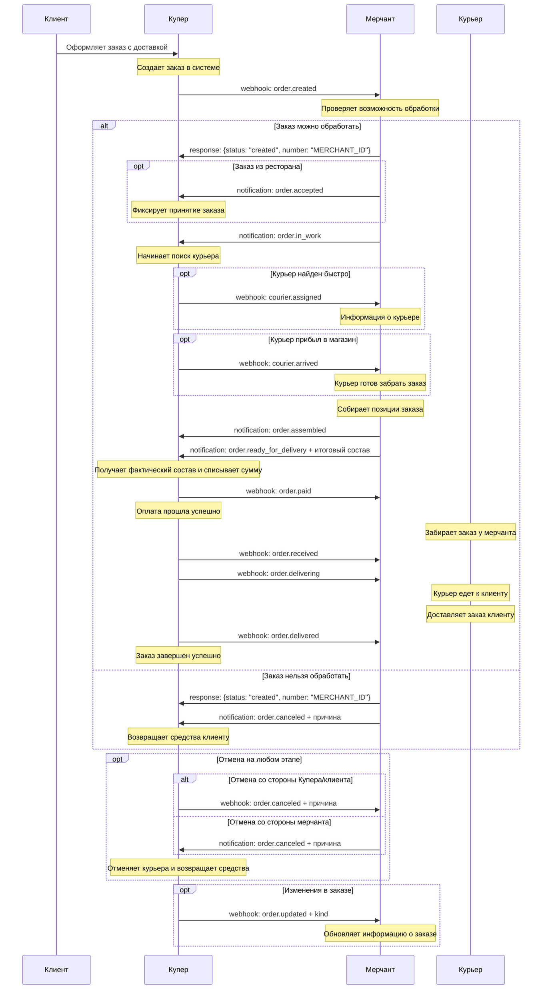
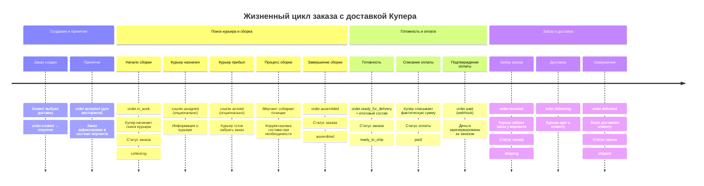

# Интеграция с доставкой Купера - Купер API

Детальное описание интеграции типа **"Сборка мерчанта, доставка Купера"** для Push-модели Купер API.

## 📋 Описание процесса

При интеграции с доставкой Купера:
- **Мерчант** собирает заказ в своем магазине
- **Купер** организует доставку через своих курьеров
- **Купер** отслеживает процесс доставки от начала до конца
- **Мерчант** получает уведомления о статусе курьера и доставки

## 🔄 Основная блок-схема

```mermaid
flowchart TD
    Start([Клиент оформляет заказ с доставкой]) --> A[Купер отправляет webhook: order.created]
    A --> B{Мерчант может обработать заказ?}
    
    B -->|Да| C[Мерчант отвечает: {status: "created", number: "ID"}]
    B -->|Нет| D[Мерчант отвечает: {status: "created"}, затем order.canceled]
    
    C --> E{Заказ из ресторана?}
    E -->|Да| F[Мерчант отправляет: order.accepted]
    E -->|Нет| G[Мерчант начинает сборку]
    F --> G
    
    G --> H[Мерчант отправляет: order.in_work]
    H --> I[Купер начинает поиск курьера]
    I --> J{Курьер найден?}
    J -->|Да| K[Купер отправляет: courier.assigned]
    J -->|Нет| L[Мерчант продолжает сборку]
    K --> M{Курьер прибыл?}
    M -->|Да| N[Купер отправляет: courier.arrived]
    M -->|Нет| L
    N --> L
    
    L --> O[Мерчант собирает заказ]
    O --> P[Мерчант отправляет: order.assembled]
    P --> Q[Мерчант отправляет: order.ready_for_delivery + итоговый состав]
    
    Q --> R[Купер списывает фактическую сумму]
    R --> S[Купер отправляет webhook: order.paid]
    S --> T[Курьер забирает заказ]
    T --> U[Купер отправляет: order.received]
    U --> V[Купер отправляет: order.delivering]
    V --> W[Курьер доставляет заказ]
    W --> X[Купер отправляет: order.delivered]
    
    D --> Cancel[Заказ отменен]
    X --> End([Заказ завершен])
    Cancel --> End
    
    subgraph "Возможные отмены"
        AnyCancel[order.canceled с причиной на любом этапе до доставки]
    end
    
    style Start fill:#e8f5e8
    style End fill:#c8e6c9
    style Cancel fill:#ffcdd2
    style A fill:#fff3e0
    style H fill:#fff3e0
    style K fill:#e1f5fe
    style N fill:#e1f5fe
    style P fill:#fff3e0
    style Q fill:#fff3e0
    style S fill:#e1f5fe
    style U fill:#e1f5fe
    style V fill:#e1f5fe
    style X fill:#e1f5fe
```

## 📱 Детальная схема обмена сообщениями



## 🎯 Временная шкала событий



## 📋 Ключевые особенности доставки Купера

### ✅ Особенности курьерской службы:

1. **courier.assigned** - Назначение курьера
   - Приходит после `order.in_work`, до `order.paid`
   - Содержит информацию о курьере (имя, телефон, возможно фото)
   - Может не прийти, если курьер назначается в последний момент

2. **courier.arrived** - Прибытие курьера
   - Приходит после `courier.assigned`, до `order.paid`
   - Означает, что курьер находится в магазине и готов забрать заказ
   - Помогает мерчанту понять, что нужно ускорить сборку

3. **order.received** - Забор заказа
   - Приходит строго после `order.paid`
   - Означает, что курьер забрал заказ и покинул магазин
   - С этого момента заказ находится у курьера

4. **order.delivering** - Процесс доставки
   - Курьер едет к клиенту
   - Клиент может отслеживать курьера в приложении

5. **order.delivered** - Завершение доставки
   - Курьер доставил заказ клиенту
   - Заказ полностью завершен

### 🚚 Логистические особенности:

- Купер самостоятельно управляет курьерами
- Мерчант не контролирует процесс доставки
- Все вебхуки о доставке приходят от Купера
- Время доставки зависит от загрузки курьерской службы

### 📦 Процесс передачи заказа курьеру:

1. Курьер приходит в магазин (может прийти `courier.arrived`)
2. Мерчант завершает сборку и отправляет `order.ready_for_delivery`
3. Купер списывает оплату и отправляет `order.paid`
4. Курьер забирает заказ (приходит `order.received`)
5. Начинается доставка (приходит `order.delivering`)

## 📨 Примеры вебхуков от Купера

### 1. Назначение курьера

```json
POST /your-webhook-endpoint
Content-Type: application/json
Authorization: Bearer your-token

{
  "event_type": "courier.assigned",
  "payload": {
    "orderUUID": "retailer-slug:265cb601-a78a-4862-9e9d-d6b48d6a0a3f",
    "number": "MERCHANT_ORDER_12345",
    "courier": {
      "name": "Иван Петров",
      "phone": "+7900123456"
    }
  }
}
```

### 2. Прибытие курьера

```json
POST /your-webhook-endpoint
Content-Type: application/json
Authorization: Bearer your-token

{
  "event_type": "courier.arrived",
  "payload": {
    "orderUUID": "retailer-slug:265cb601-a78a-4862-9e9d-d6b48d6a0a3f",
    "number": "MERCHANT_ORDER_12345",
    "courier": {
      "name": "Иван Петров",
      "phone": "+7900123456"
    }
  }
}
```

### 3. Подтверждение оплаты

```json
POST /your-webhook-endpoint
Content-Type: application/json
Authorization: Bearer your-token

{
  "event_type": "order.paid",
  "payload": {
    "orderUUID": "retailer-slug:265cb601-a78a-4862-9e9d-d6b48d6a0a3f",
    "number": "MERCHANT_ORDER_12345",
    "payment": {
      "amount": "189.99",
      "currency": "RUB",
      "method": "card"
    }
  }
}
```

### 4. Забор заказа курьером

```json
POST /your-webhook-endpoint
Content-Type: application/json
Authorization: Bearer your-token

{
  "event_type": "order.received",
  "payload": {
    "orderUUID": "retailer-slug:265cb601-a78a-4862-9e9d-d6b48d6a0a3f",
    "number": "MERCHANT_ORDER_12345",
    "courier": {
      "name": "Иван Петров",
      "phone": "+7900123456"
    }
  }
}
```

### 5. Начало доставки

```json
POST /your-webhook-endpoint
Content-Type: application/json
Authorization: Bearer your-token

{
  "event_type": "order.delivering",
  "payload": {
    "orderUUID": "retailer-slug:265cb601-a78a-4862-9e9d-d6b48d6a0a3f",
    "number": "MERCHANT_ORDER_12345",
    "estimatedDeliveryTime": "2024-01-15T16:30:00+03:00"
  }
}
```

### 6. Завершение доставки

```json
POST /your-webhook-endpoint
Content-Type: application/json
Authorization: Bearer your-token

{
  "event_type": "order.delivered",
  "payload": {
    "orderUUID": "retailer-slug:265cb601-a78a-4862-9e9d-d6b48d6a0a3f",
    "number": "MERCHANT_ORDER_12345",
    "deliveredAt": "2024-01-15T16:25:00+03:00"
  }
}
```

## ⚠️ Критические моменты

### 🔴 Обязательные требования:

1. **Правильный порядок событий**:
   - `courier.assigned/arrived` → **до** `order.paid`
   - `order.received/delivering/delivered` → **после** `order.paid`

2. **В order.ready_for_delivery обязательно передавать итоговый состав** заказа

3. **Отвечать успешно на все вебхуки от Купера** (статус 200)

4. **Не отправлять order.delivered от мерчанта** - доставка контролируется Купером

### 📱 UX для клиента:

- Клиент видит информацию о назначенном курьере
- Клиент может отслеживать курьера на карте
- Клиент получает уведомления на каждом этапе доставки
- После доставки клиент может оценить качество доставки

### 🏪 Процесс в магазине:

1. Подготовиться к приходу курьера после `courier.assigned/arrived`
2. Быстро завершить сборку при получении `courier.arrived`
3. Передать заказ курьеру после получения `order.paid`
4. Не беспокоиться о процессе доставки - это зона ответственности Купера

## 📋 Чек-лист реализации

### ✅ Обязательная функциональность:

- [ ] Обработка вебхука `courier.assigned` с информацией о курьере
- [ ] Обработка вебхука `courier.arrived` для ускорения сборки
- [ ] Отправка `order.ready_for_delivery` с итоговым составом
- [ ] Обработка `order.paid` как сигнала к передаче заказа курьеру
- [ ] Обработка `order.received/delivering/delivered` для отслеживания
- [ ] Логирование всех вебхуков от Купера

### 🔄 Дополнительные возможности:

- [ ] Уведомления сотрудников о прибытии курьера
- [ ] Отображение информации о курьере в интерфейсе
- [ ] Приоритизация заказов с назначенными курьерами
- [ ] Интеграция с системой управления складом
- [ ] Мониторинг времени ожидания курьера

### 🧪 Тестовые сценарии:

- [ ] Успешный заказ с быстрым назначением курьера
- [ ] Заказ без `courier.assigned` (поздно назначили курьера)
- [ ] Заказ с `courier.arrived` перед готовностью
- [ ] Отмена заказа после назначения курьера
- [ ] Изменение состава заказа в процессе сборки
- [ ] Обработка задержек в доставке

## 🎯 Порядок событий

### Правильная последовательность:

```
1. order.created (webhook от Купера)
2. response: {status: "created", number: "ID"}
3. order.accepted (для ресторанов)
4. order.in_work
5. courier.assigned (опционально, до order.paid)
6. courier.arrived (опционально, до order.paid)
7. order.assembled
8. order.ready_for_delivery + итоговый состав
9. order.paid (webhook от Купера)
10. order.received (webhook от Купера)
11. order.delivering (webhook от Купера)
12. order.delivered (webhook от Купера)
```

### ❌ Типичные ошибки:

- Отправка `order.delivered` от мерчанта (доставка контролируется Купером)
- Ожидание `courier.assigned` перед началом сборки
- Передача заказа курьеру до получения `order.paid`
- Игнорирование `courier.arrived` при планировании сборки

## 🚀 Оптимизация процесса

### 📈 Рекомендации по производительности:

1. **При получении `courier.assigned`** - приоритизируйте сборку этого заказа
2. **При получении `courier.arrived`** - ускорьте завершение сборки
3. **Поддерживайте быструю сборку** - курьеры не любят ждать
4. **Отслеживайте время ожидания курьера** - это влияет на качество сервиса

### 🔄 Интеграция с внутренними системами:

- Интегрируйте получение `courier.assigned/arrived` с системой склада
- Настройте уведомления сотрудников о прибытии курьера
- Ведите статистику времени сборки заказов
- Анализируйте время ожидания курьеров

---

**Связанные файлы:**
- [Общая схема Push-модели](./kuper-push-model-flowchart.md)
- [Самовывоз](./kuper-pickup-integration.md)
- [Справочник API](./kuper-api-reference.md)
- [Диаграммы состояний](./kuper-order-states.md)

**Документация:** [docs.kuper.ru](https://docs.kuper.ru/api-products/merchant-service/orders/description) 