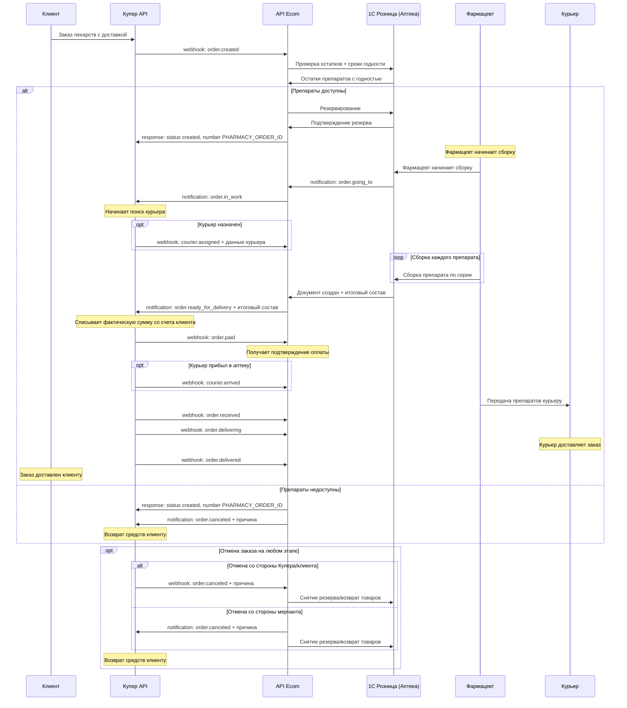
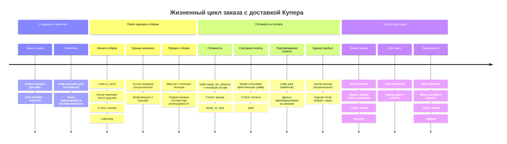

# Интеграция с доставкой Купера - Купер API

Детальное описание интеграции типа **"Сборка мерчанта, доставка Купера"** для Push-модели Купер API.

## 📋 Описание процесса

При интеграции с доставкой Купера:
- **Мерчант** собирает заказ в своем магазине
- **Купер** организует доставку через своих курьеров
- **Купер** отслеживает процесс доставки от начала до конца
- **Мерчант** получает уведомления о статусе курьера и доставки

## 📱 Детальная схема обмена сообщениями

## 🎯 Временная шкала событий

## 📋 Ключевые особенности доставки Купера

### ✅ Особенности курьерской службы:

1. **courier.assigned** - Назначение курьера
   - Приходит после `order.in_work`, до `order.paid`
   - Содержит информацию о курьере (имя, телефон, возможно фото)
   - Может не прийти, если курьер назначается в последний момент

2. **courier.arrived** - Прибытие курьера
   - Приходит после `courier.assigned`, до `order.paid`
   - Означает, что курьер находится в магазине и готов забрать заказ
   - Помогает мерчанту понять, что нужно ускорить сборку

3. **order.received** - Забор заказа
   - Приходит строго после `order.paid`
   - Означает, что курьер забрал заказ и покинул магазин
   - С этого момента заказ находится у курьера

4. **order.delivering** - Процесс доставки
   - Курьер едет к клиенту
   - Клиент может отслеживать курьера в приложении

5. **order.delivered** - Завершение доставки
   - Курьер доставил заказ клиенту
   - Заказ полностью завершен

### 🚚 Логистические особенности:

- Купер самостоятельно управляет курьерами
- Мерчант не контролирует процесс доставки
- Все вебхуки о доставке приходят от Купера
- Время доставки зависит от загрузки курьерской службы

### 📦 Процесс передачи заказа курьеру:

1. Курьер приходит в магазин (может прийти `courier.arrived`)
2. Мерчант завершает сборку и отправляет `order.ready_for_delivery`
3. Купер списывает оплату и отправляет `order.paid`
4. Курьер забирает заказ (приходит `order.received`)
5. Начинается доставка (приходит `order.delivering`)
