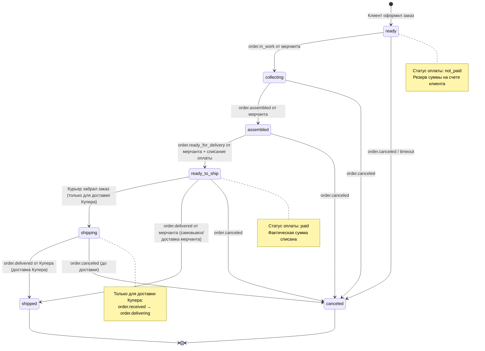
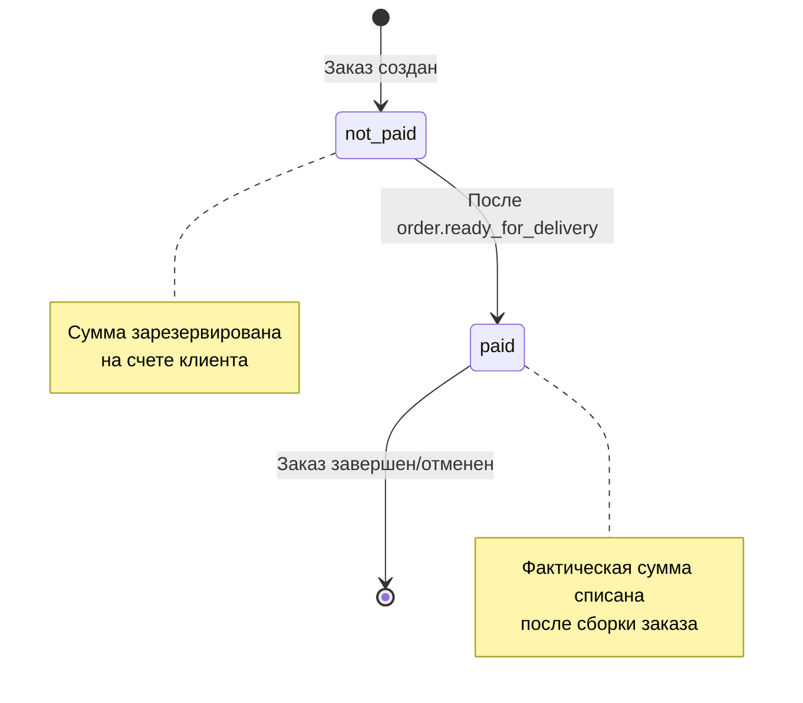
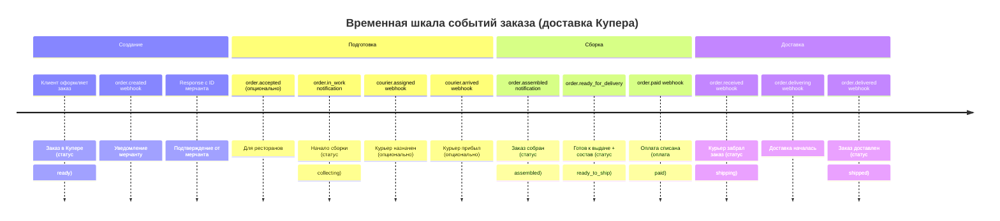
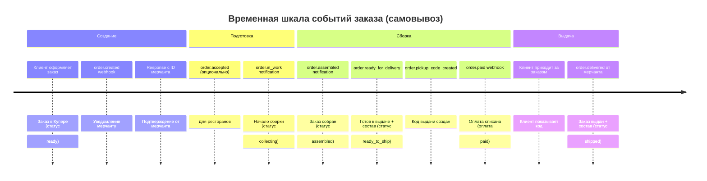
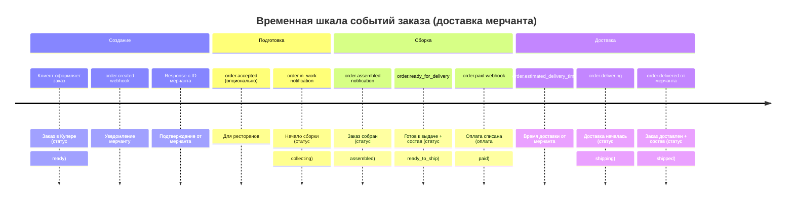
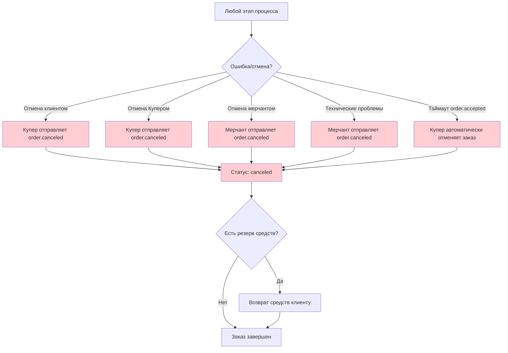
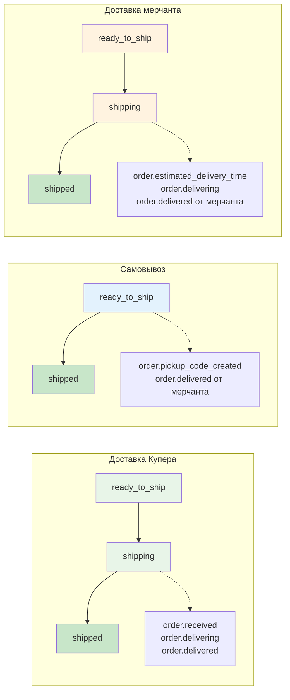

# Диаграмма состояний заказа в Push-модели Купер API

## Состояния заказа в системе Купера



## Состояния оплаты



## Детальный жизненный цикл по типам интеграции

### Для типа "Сборка мерчанта, доставка Купера"



### Для типа "Сборка мерчанта, самовывоз"



### Для типа "Сборка мерчанта, доставка мерчанта"



## Обработка ошибок и отмен



## Сравнение типов интеграции

### Основные различия в статусах



## Критические моменты

### ⚠️ Важные правила

1. **order.created**: Всегда отвечать успешно, даже если заказ нельзя обработать
2. **order.ready_for_delivery**: Обязательно передавать итоговый состав заказа
3. **Отмены**: Указывать причину в поле `cancellation`
4. **Таймауты**: Купер отменяет заказ при отсутствии `order.accepted` в установленное время (только для ресторанов)
5. **Аутентификация**: Поддерживать авторизацию входящих вебхуков
6. **Порядок событий**: Соблюдать правильную последовательность уведомлений

### 📋 Обязательные поля ответов

**order.created response:**
```json
{
  "status": "created",
  "number": "ID_заказа_в_системе_мерчанта",
  "expectedAssemblyTime": "2021-05-24T13:45:00+03:00" // опционально
}
```

**order.ready_for_delivery notification:**
```json
{
  "event_type": "order.ready_for_delivery",
  "payload": {
    "orderUUID": "...",
    "number": "...",
    "positions": [...], // ОБЯЗАТЕЛЬНО: итоговый состав
    "total": {...}      // ОБЯЗАТЕЛЬНО: итоговая сумма
  }
}
```

**order.delivered notification (для самовывоза/доставки мерчанта):**
```json
{
  "event_type": "order.delivered",
  "payload": {
    "orderUUID": "...",
    "number": "...",
    "positions": [...], // ОБЯЗАТЕЛЬНО: итоговый состав выданного
    "total": {...}      // ОБЯЗАТЕЛЬНО: итоговая сумма выданного
  }
}
```

**order.canceled notification:**
```json
{
  "event_type": "order.canceled",
  "payload": {
    "orderUUID": "...",
    "number": "...",
    "cancellation": {
      "slug": "reason_code",
      "description": "Описание причины отмены"
    }
  }
}
``` 