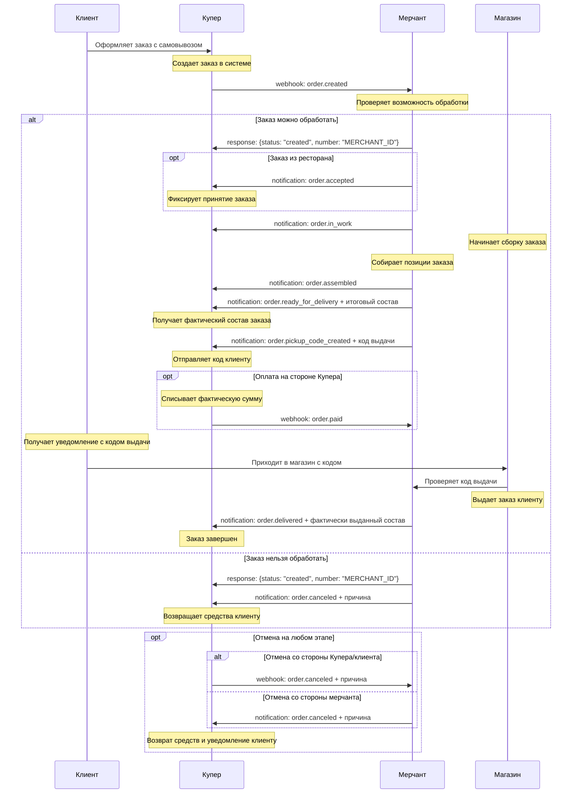
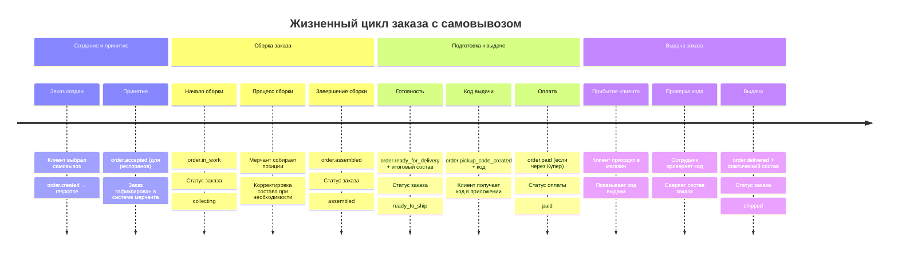

# Интеграция с самовывозом - Купер API

Детальное описание интеграции типа **"Сборка мерчанта, самовывоз"** для Push-модели Купер API.

## 📋 Описание процесса

При интеграции с самовывозом:
- **Мерчант** собирает заказ в своем магазине
- **Клиент** самостоятельно приезжает и забирает заказ
- **Купер** обрабатывает оплату и уведомления клиенту
- **Мерчант** создает код выдачи и контролирует процесс выдачи

## 🔄 Основная блок-схема

```mermaid
flowchart TD
    Start([Клиент оформляет заказ с самовывозом]) --> A[Купер отправляет webhook: order.created]
    A --> B{Мерчант может обработать заказ?}
    
    B -->|Да| C[Мерчант отвечает: {status: "created", number: "ID"}]
    B -->|Нет| D[Мерчант отвечает: {status: "created"}, затем order.canceled]
    
    C --> E{Заказ из ресторана?}
    E -->|Да| F[Мерчант отправляет: order.accepted]
    E -->|Нет| G[Мерчант начинает сборку]
    F --> G
    
    G --> H[Мерчант отправляет: order.in_work]
    H --> I[Мерчант собирает заказ]
    I --> J[Мерчант отправляет: order.assembled]
    J --> K[Мерчант отправляет: order.ready_for_delivery + итоговый состав]
    
    K --> L[Мерчант отправляет: order.pickup_code_created]
    L --> M{Оплата на стороне Купера?}
    M -->|Да| N[Купер отправляет webhook: order.paid]
    M -->|Нет| O[Оплата при получении]
    
    N --> P[Клиент приходит за заказом с кодом]
    O --> P
    P --> Q[Мерчант проверяет код выдачи]
    Q --> R[Мерчант отправляет: order.delivered + итоговый состав]
    
    D --> Cancel[Заказ отменен]
    R --> End([Заказ завершен])
    Cancel --> End
    
    subgraph "Возможные отмены"
        AnyCancel[order.canceled с причиной на любом этапе до выдачи]
    end
    
    style Start fill:#e3f2fd
    style End fill:#c8e6c9
    style Cancel fill:#ffcdd2
    style A fill:#fff3e0
    style H fill:#fff3e0
    style J fill:#fff3e0
    style K fill:#fff3e0
    style L fill:#fff3e0
    style N fill:#e8f5e8
    style R fill:#e8f5e8
```

## 📱 Детальная схема обмена сообщениями



## 🎯 Временная шкала событий



## 📋 Ключевые особенности самовывоза

### ✅ Обязательные шаги для мерчанта:

1. **order.pickup_code_created** - Создание кода выдачи
   - Отправляется после `order.ready_for_delivery`
   - Код должен быть уникальным для заказа
   - Купер передает код клиенту в приложении

2. **order.delivered** - Подтверждение выдачи
   - Отправляется когда клиент забрал заказ
   - **Обязательно** включает фактически выданный состав
   - Может отличаться от заказанного (замены, отсутствующие позиции)

### 🔄 Процесс выдачи:

1. Клиент приходит в магазин
2. Показывает код выдачи (из приложения Купера)
3. Сотрудник проверяет код в системе
4. Выдает заказ клиенту
5. Мерчант отправляет `order.delivered`

### 💳 Варианты оплаты:

- **Оплата через Купер**: Средства списываются после `order.ready_for_delivery`
- **Оплата при получении**: Клиент оплачивает в магазине при выдаче

## 📨 Примеры запросов

### 1. Создание кода выдачи

```json
POST https://merchant-api.sbermarket.ru/ofm/api/v1/notifications
Content-Type: application/json
Authorization: Bearer your-token

{
  "event_type": "order.pickup_code_created",
  "payload": {
    "orderUUID": "retailer-slug:265cb601-a78a-4862-9e9d-d6b48d6a0a3f",
    "number": "MERCHANT_ORDER_12345",
    "pickupCode": "1234"
  }
}
```

### 2. Подтверждение выдачи заказа

```json
POST https://merchant-api.sbermarket.ru/ofm/api/v1/notifications
Content-Type: application/json
Authorization: Bearer your-token

{
  "event_type": "order.delivered",
  "payload": {
    "orderUUID": "retailer-slug:265cb601-a78a-4862-9e9d-d6b48d6a0a3f",
    "number": "MERCHANT_ORDER_12345",
    "positions": [
      {
        "id": "123456",
        "quantity": 1,
        "price": "199.99",
        "discountPrice": "189.99",
        "totalPrice": "189.99",
        "weight": "500"
      }
    ],
    "total": {
      "totalPrice": "189.99",
      "discountTotalPrice": "189.99"
    }
  }
}
```

## ⚠️ Критические моменты

### 🔴 Обязательные требования:

1. **Код выдачи должен быть уникальным** для каждого заказа
2. **В order.delivered обязательно передавать фактический состав** выданного заказа
3. **Проверять код выдачи** перед выдачей заказа клиенту
4. **Отправлять order.delivered только после фактической выдачи** заказа

### 📱 UX для клиента:

- Клиент получает push-уведомление с кодом выдачи
- Код отображается в приложении Купера
- При прибытии в магазин клиент показывает код сотруднику
- После выдачи клиент получает подтверждение о завершении заказа

### 🏪 Процесс в магазине:

1. Настроить систему генерации уникальных кодов выдачи
2. Обучить сотрудников процедуре проверки кодов
3. Организовать зону выдачи заказов
4. Обеспечить возможность проверки состава заказа

## 📋 Чек-лист реализации

### ✅ Обязательная функциональность:

- [ ] Генерация уникальных кодов выдачи
- [ ] Отправка `order.pickup_code_created` с кодом
- [ ] Система проверки кодов выдачи в магазине
- [ ] Отправка `order.delivered` с фактическим составом
- [ ] Обработка отмен до момента выдачи
- [ ] Логирование всех операций с кодами

### 🔄 Дополнительные возможности:

- [ ] QR-коды для более удобной проверки
- [ ] SMS/Email дублирование кода выдачи
- [ ] Уведомления об изменении статуса сборки
- [ ] Возможность изменения времени самовывоза
- [ ] Интеграция с кассовой системой

### 🧪 Тестовые сценарии:

- [ ] Успешный заказ с оплатой через Купер
- [ ] Успешный заказ с оплатой при получении
- [ ] Отмена заказа до создания кода выдачи
- [ ] Отмена заказа после создания кода выдачи
- [ ] Изменение состава при сборке
- [ ] Проверка дубликатов кодов выдачи

## 🎯 Порядок событий

### Правильная последовательность:

```
1. order.created (webhook от Купера)
2. response: {status: "created", number: "ID"}
3. order.accepted (для ресторанов)
4. order.in_work
5. order.assembled
6. order.ready_for_delivery + итоговый состав
7. order.pickup_code_created + код
8. order.paid (если оплата через Купер)
9. [Клиент приходит в магазин]
10. order.delivered + фактический состав
```

### ❌ Типичные ошибки:

- Отправка `order.delivered` без фактического состава
- Генерация неуникальных кодов выдачи
- Отправка `order.pickup_code_created` до `order.ready_for_delivery`
- Отсутствие проверки кода перед выдачей заказа

---

**Связанные файлы:**
- [Общая схема Push-модели](./kuper-push-model-flowchart.md)
- [Доставка Купера](./kuper-delivery-integration.md)
- [Справочник API](./kuper-api-reference.md)
- [Диаграммы состояний](./kuper-order-states.md)

**Документация:** [docs.kuper.ru](https://docs.kuper.ru/api-products/merchant-service/orders/description) 