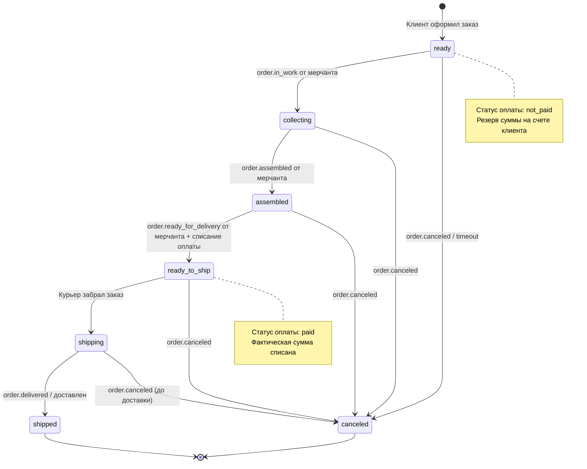
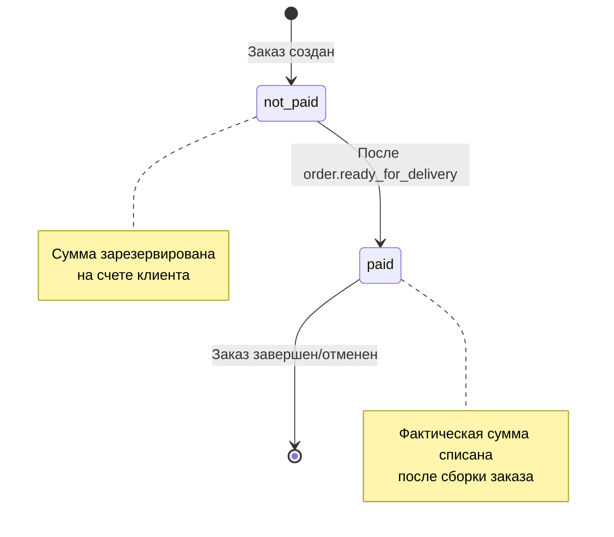
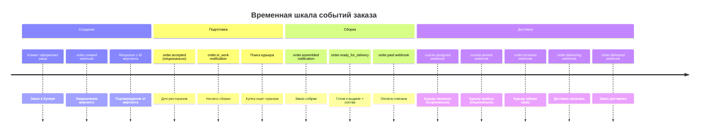
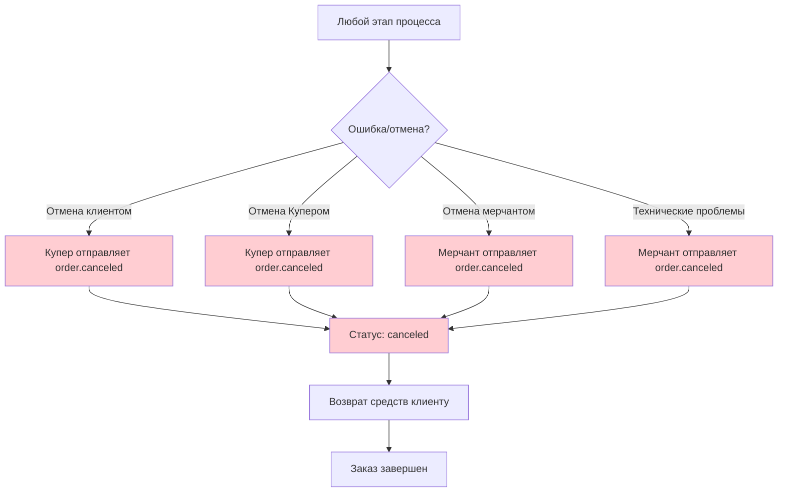
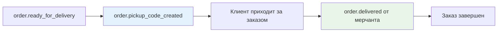
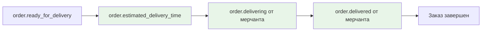

# Диаграмма состояний заказа в Push-модели Купер API

## Состояния заказа в системе Купера



## Состояния оплаты



## Жизненный цикл событий

### Для типа "Сборка мерчанта, доставка Купера"



## Обработка ошибок и отмен



## Особенности для разных типов интеграции

### Сборка мерчанта, самовывоз



### Сборка мерчанта, доставка мерчанта



## Критические моменты

### ⚠️ Важные правила

1. **order.created**: Всегда отвечать успешно, даже если заказ нельзя обработать
2. **order.ready_for_delivery**: Обязательно передавать итоговый состав заказа
3. **Отмены**: Указывать причину в поле `cancellation`
4. **Таймауты**: Купер отменяет заказ при отсутствии `order.accepted` в установленное время
5. **Аутентификация**: Поддерживать авторизацию входящих вебхуков

### 📋 Обязательные поля ответов

**order.created response:**
```json
{
  "status": "created",
  "number": "ID_заказа_в_системе_мерчанта",
  "expectedAssemblyTime": "2021-05-24T13:45:00+03:00" // опционально
}
```

**order.canceled notification:**
```json
{
  "cancellation": {
    "slug": "reason_code",
    "description": "Описание причины отмены"
  }
}
``` 