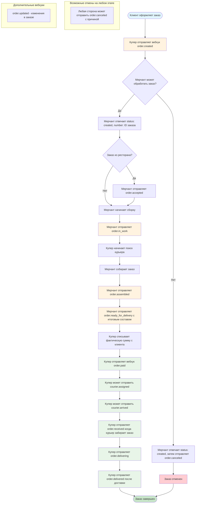
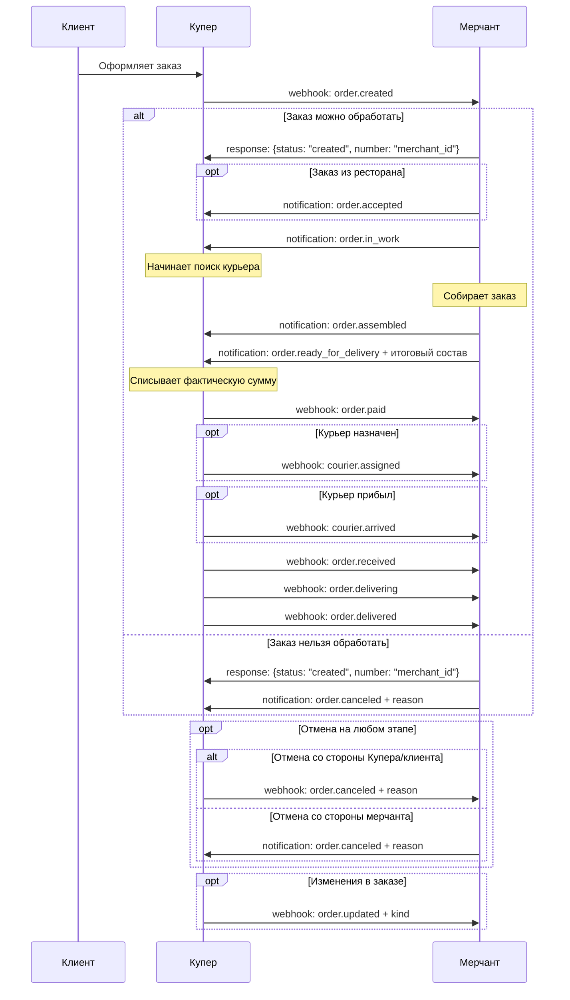

# Блок-схема Push-модели для работы с заказами Купер API

## Общее описание

Push-модель интеграции с Купер API предполагает, что Купер отправляет вебхуки со статусами заказов мерчанту, а мерчант отвечает на них и передает уведомления об изменениях заказа.

Основные компоненты:
- **Вебхуки** — сообщения от Купера к мерчанту
- **Уведомления** — сообщения от мерчанта к Куперу
- **Аутентификация** — через Bearer Token или Basic Auth

## Блок-схема для типа интеграции "Сборка мерчанта, доставка Купера"

## Детальная схема обмена сообщениями

## Ключевые моменты для реализации

### 1. Обработка вебхука order.created
- **Обязательно** ответить в формате: `{status: "created", number: "ID_в_системе_мерчанта"}`
- Если заказ нельзя обработать - ответить успешно, затем отправить `order.canceled`

### 2. Обязательные уведомления от мерчанта
- `order.accepted` - для заказов из ресторанов
- `order.in_work` - начало сборки
- `order.assembled` - заказ собран  
- `order.ready_for_delivery` - заказ готов + **итоговый состав обязателен**

### 3. Отмена заказов
- Можно отменить на любом этапе до доставки
- Всегда указывать причину отмены
- Если ошибка на этапе `order.created` - ответить успешно, затем `order.canceled`

### 4. Аутентификация
- Все запросы с Bearer Token или Basic Auth
- Поддержать авторизацию входящих вебхуков от Купера

### 5. Production endpoints
- Уведомления: `https://merchant-api.sbermarket.ru/ofm/api/v1/notifications`
- Авторизация: `https://merchant-api.sbermarket.ru/auth/token`

## Типы интеграций

### Поддерживаются 3 типа:
1. **Сборка мерчанта, доставка Купера** (показана в схеме выше)
2. **Сборка мерчанта, самовывоз** - дополнительно `order.pickup_code_created`, `order.delivered` от мерчанта
3. **Сборка мерчанта, доставка мерчанта** - дополнительно `order.estimated_delivery_time`, `order.delivering`, `order.delivered` от мерчанта

---

**Документация:** [Купер API](https://docs.kuper.ru/api-products/merchant-service/orders/description)

**Контакты:**
- Интеграция: new.partners@sbermarket.ru  
- Техподдержка: kuper-api@kuper.ru
- API вопросы: orders.api@sbermarket.ru 